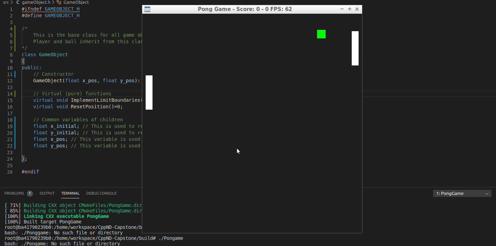
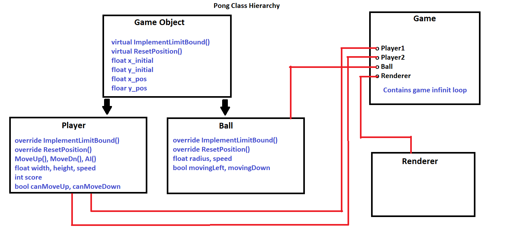

# Pong C++

This is my submission for the final project of the [Udacity C++ Nanodegree Program](https://www.udacity.com/course/c-plus-plus-nanodegree--nd213). I decided to make a pong game clone in C++. I used [SDL](https://libsdl.org/download-2.0.php) library to take care of renderring and input detection.

## About the Game

It's a clone of the classic pong game where the player can control the player in the left side. The right side is controlled by a simple AI.

## Features

- Simple collision detection
- Basic AI to try to track the ball
- Calculating score and showing it in the toolbar in the format `0 - 0`
- Reset players and ball position on each round
- The AI sometimes try to miss the ball to give the player a fair chance (gameplay balance)

## How to Play

- At the beginning of each round, press `Up arrow`, `Down arrow` or `Space` bar to start game
- Control your sprite by pressing `Up arrow` or `Down arrow`

## Project Structure

This diagram shows the class hierarchy

## Addressed Rubric Points

| Rubric Item | Comment/Location |
| --- | --- |
| The project demonstrates an understanding of C++ functions and control structures. | Please take a overlook for all files. I used multiple `control structures` where necessary |
| The project accepts user input and processes the input | Please check `Controller::HandleInput()` |
| The project uses Object Oriented Programming techniques | Please take a overlook for all files. The code is organized into classes with class attributes to hold the data, and class methods to perform tasks |
| Classes use appropriate access specifiers for class members | Please take a overlook for all files. All class data members are explicitly specified as public, protected, or private |
| Classes abstract implementation details from their interfaces | Please take a overlook for all files. All class member functions document their effects, either through function names, comments, or formal documentation Member functions do not change program state in undocumented ways |
| Classes follow an appropriate inheritance hierarchy | Please check the abstracl class `GameObject` it contains pure virtual functions `ImplementLimitBoundaries()` and `ResetPosition()` |
| Derived class functions override virtual base class functions | Please check `Ball` class and `Player` class. They override the virtual methods mentiond in the previous point |
| The project makes use of references in function declarations | Please check `Ball::DetecCollision()`,  `Player::AI()`, `Game::Update()` and `Controller::HandleInput()`. They all use pass-by-reference |

## Dependencies for Running Locally
* cmake >= 3.7
  * All OSes: [click here for installation instructions](https://cmake.org/install/)
* make >= 4.1 (Linux, Mac), 3.81 (Windows)
  * Linux: make is installed by default on most Linux distros
  * Mac: [install Xcode command line tools to get make](https://developer.apple.com/xcode/features/)
  * Windows: [Click here for installation instructions](http://gnuwin32.sourceforge.net/packages/make.htm)
* SDL2 >= 2.0
  * All installation instructions can be found [here](https://wiki.libsdl.org/Installation)
  * Note that for Linux, an `apt` or `apt-get` installation is preferred to building from source.
* gcc/g++ >= 5.4
  * Linux: gcc / g++ is installed by default on most Linux distros
  * Mac: same deal as make - [install Xcode command line tools](https://developer.apple.com/xcode/features/)
  * Windows: recommend using [MinGW](http://www.mingw.org/)

## Basic Build Instructions

1. Clone this repo.
2. Make a build directory in the top level directory: `mkdir build && cd build`
3. Compile: `cmake .. && make`
4. Run it: `./PongGame`.